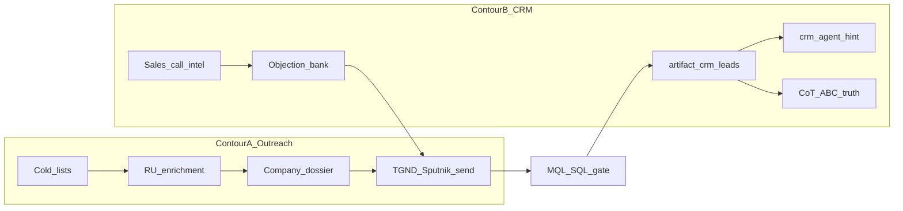

# CRM × Outreach: B2B Conversion System (2026)

Файл: `artifact_crm_outreach_b2b_conversion_system_2026.md`
Путь сохранения: `SecondBrain/40_Artifacts/`
Тип документа: `Artifact`

Архитектурный хаб: как четыре B2B-практики роста конверсии стыкуются с двухконтурной моделью Outreach → CRM в Second Brain.

Смежные спеки: [artifact_crm_outreach_qualification_policy.md](artifact_crm_outreach_qualification_policy.md), [project_outreach_system_design.md](../20_Business_Projects/sputnik_films/outreach/project_outreach_system_design.md), роль [role_sales_newbiz.md](../60_System/roles/role_sales_newbiz.md).

---

## 1. Двухконтурная модель (якорь)

| Контур | Назначение | Источник правды |
|--------|------------|-----------------|
| **A — Outreach Engine** | Холодные касания, follow-up, reply ops | TGND / Sputnik outreach sheets + статусы |
| **B — CRM Pipeline** | Только qualified лиды, winrate, forecast | `artifact_crm_leads_2026.md` |

Gate A→B: политика квалификации. Winrate считается **только** по контуру B.

---

## 2. Четыре практики → слоты в архитектуре

| # | Практика | Контур | Режим в SB | Skill / артефакт |
|---|----------|--------|------------|------------------|
| 1 | Досье до первого касания | A (pre-touch) | Semi-auto | `.cursor/skills/crm-company-dossier/` |
| 2 | Анализ звонков → банк возражений | B (+ feedback в A) | Semi-auto | режим в `meeting-report-prod` + `artifact_sales_objection_bank_2026.md` |
| 3 | Оцифровка топ-продавца | B / enablement | По запросу | `.cursor/skills/sales-top-performer-digitize/` |
| 4 | Квалификация / приоритизация | A (фильтр базы) + B (пайплайн) | Semi-auto | режим в `sales-newbiz` + `crm_agent` (hint) |

---

## 3. Mapping скоринга (не путать два слоя)

| Слой | Что это | Куда писать | Статус |
|------|---------|-------------|--------|
| **crm_agent** 0–100 | Heuristic triage (бюджет × тип × freshness × ecosystem) | `report_crm_agent_*.md`, dashboard JSON | Авто, read-only к CRM MD |
| **CoT A/B/C** | Qualification truth (8 критериев Playbook) | Карточка CRM `Скоринг`, gate A→B | Вручную / чат с Sales-ролью |
| **Приоритизация пайплайна** | Корзины: сегодня / греем / не тратим | Ответ в чате + опционально факт в журнале | Режим Sales skill |

Правило: agent score = **подсказка очереди**; CoT A/B/C = **истина для квалификации**. Агент не пишет A/B/C в MD (roadmap: draft CoT в report, без mutate).

Холодная воронка «500 → ~100»: фильтр ICP + батч-досье **до** кампании в контуре A, не через CRM MD.

---

## 4. RU enrichment stack (не Clay / Apollo)

Для РФ / СНГ — без Clay и Apollo как зависимостей SB.

| Инструмент | Роль | В SB |
|------------|------|------|
| **crm-contact-factcheck** | Сфера + должность + URL | Да (skill) |
| **build_crm_research_queue.py** | Очередь батч-ресёрча | Да |
| **Rusprofile / Checko** | Юрлицо, ЕГРЮЛ, гендир как ЛПР МСБ | Open-web в factcheck/dossier |
| **Контур.Компас** | Базы org → CRM export | Внешний; документирован как источник списков |
| **Export-Base** | Нишевые выгрузки | Внешний; вход в Contour A |
| **Amo import** | `import_amo_contacts.py` → safe index | Да |
| **Clay** | Сигналы по большому списку (intl) | **Out of scope** MVP; later при intl ABM |
| **Apollo** | ЛПР + email (intl) | **Out of scope** MVP |

Масштаб без Clay: очередь + батч Claude/агент по `crm-company-dossier` на топ приоритета, не «все 18k вручную».

Транскрипты звонков: **MacWhisper → meeting-transcript-pipeline** (канон). Fathom / tl;dv — опция владельца, не зависимость SB.

---

## 5. Автоматизация / semi-auto / вручную

| Шаг | Режим |
|-----|--------|
| Парс CRM + heuristic score + staleness | Авто (`crm_agent --full`) |
| Company dossier + 3 захода письма | Semi-auto (skill по запросу / перед cold touch) |
| Factcheck контакта | Semi-auto (батчи) |
| Sales call intelligence → objection bank | Semi-auto (после client sales call) |
| CoT A/B/C, gate A→B | Вручную / Sales-роль + подтверждение |
| Оцифровка топ-продавца | По запросу / после серии wins |
| Приоритизация пайплайна (3 корзины) | Semi-auto (режим Sales) |

---

## 6. Триггеры для агента

| Запрос пользователя | Куда идти |
|---------------------|-----------|
| «досье на компанию X», pre-outreach | skill `crm-company-dossier` |
| «факт-чек контактов», сфера/должность | skill `crm-contact-factcheck` |
| «подготовь к созвону» (клиент) | `call-prep` → при отсутствии досье сначала dossier |
| «саммари встречи» / client sales call | `meeting-report-prod` + режим sales-call-intelligence |
| «банк возражений», паттерны звонков | `artifact_sales_objection_bank_2026.md` + call-intel |
| «оцифруй топ-сейлза / продажи» | skill `sales-top-performer-digitize` |
| «приоритизируй CRM / пайплайн» | sales-newbiz режим prioritize |
| «прогони CRM-агента» | `python3 60_System/automation/crm_agent/agent.py --full` |

Роутер skill: [sales-newbiz/SKILL.md](../.cursor/skills/sales-newbiz/SKILL.md). Role router 2.4 не раздувать — всё через Sales + call-prep / meeting-report.

---

## 7. Roadmap (не в этом заходе)

1. `crm_agent`: optional draft CoT в report (всё ещё без mutate CRM MD).
2. `skill_factcheck` внутри crm_agent (уже в domain-agents спеке).
3. Clay/Apollo только при явном intl ABM + privacy review.
4. Автоимпорт `qualified_reply` A→B после стабилизации gate.

---

## 8. Связанные документы и skills

- Policy gate: [artifact_crm_outreach_qualification_policy.md](artifact_crm_outreach_qualification_policy.md)
- Outreach design: [project_outreach_system_design.md](../20_Business_Projects/sputnik_films/outreach/project_outreach_system_design.md)
- Scoring flags: [artifact_crm_lead_scoring.md](artifact_crm_lead_scoring.md)
- Objection bank: [artifact_sales_objection_bank_2026.md](artifact_sales_objection_bank_2026.md)
- Domain agents: [note_domain_agents_design_crm_inbox_2026_07.md](../60_System/notes/note_domain_agents_design_crm_inbox_2026_07.md)
- Skills: `crm-company-dossier`, `crm-contact-factcheck`, `call-prep`, `meeting-report-prod`, `sales-top-performer-digitize`, `sales-newbiz`
